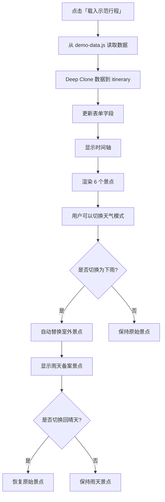

# 📖 Demo 使用指南

## 🎯 Demo 功能概述

现在系统已经整合了 `demo-data.js`，可以一键载入完整的示范行程！

---

## 🚀 使用方式

### 方法一：点击「载入示范行程」按钮

1. 打开 `plan.html`
2. 在行程设置卡片下方，可以看到两个按钮：
   - **开始规划行程** (紫色按钮) - 自行创建新行程
   - **载入示范行程** (金色渐层按钮) - ⭐ 一键载入 Demo 数据

3. 点击「载入示范行程」按钮
4. 系统会自动载入「台北一日精華遊」的完整行程

---

## 📋 Demo 行程内容

### 基本信息
- **行程名称**: 台北一日精華遊
- **日期**: 2025年10月26日 (週日)
- **总景点数**: 6 个

### 景点列表

#### 🖊️ 手动新增景点 (3个)

| 时间  | 景点名称          | 类型 | 备注               |
|-------|-------------------|------|--------------------|
| 08:00 | 阜杭豆漿          | 🏠   | 聽說要排隊一小時   |
| 10:00 | 中正紀念堂        | 🏠   | 整點可以看衛兵交接 |
| 12:30 | 隱家拉麵 (中山店) | 🏠   | -                  |

#### ✨ AI 推荐景点 (3个)

| 时间  | 景点名称          | 类型 | 备注                   | 雨天备案           |
|-------|-------------------|------|------------------------|--------------------|
| 14:30 | 大安森林公園      | ☀️   | -                      | 誠品書店信義店     |
| 17:00 | 台北101觀景台     | 🏠   | 傍晚可同時看到日夜景   | -                  |
| 19:30 | 臨江街觀光夜市    | ☀️   | -                      | 台北101美食街      |

---

## 🌧️ 天气应变模式演示

### 晴天模式（默认）
```
08:00 🏠 阜杭豆漿 [手動]
10:00 🏠 中正紀念堂 [手動]
12:30 🏠 隱家拉麵 [手動]
14:30 ☀️ 大安森林公園 [AI]
17:00 🏠 台北101觀景台 [AI]
19:30 ☀️ 臨江街觀光夜市 [AI]
```

### 切换为下雨模式
点击 Day 1 右上角的 ☀️ 按钮，会自动变成 🌧️

### 下雨模式（自动替换）
```
08:00 🏠 阜杭豆漿 [手動]
10:00 🏠 中正紀念堂 [手動]
12:30 🏠 隱家拉麵 [手動]
14:30 🏠 誠品書店信義店 [AI] ← 替換了「大安森林公園」
17:00 🏠 台北101觀景台 [AI]
19:30 🏠 台北101美食街 [AI] ← 替換了「臨江街觀光夜市」
```

### 切换回晴天模式
再次点击 🌧️ 按钮，系统会自动恢复原始景点

---

## 🎨 视觉标识说明

### 景点类型徽章
- 🏠 **室內景點** - 蓝紫色渐层徽章
- ☀️ **室外景點** - 橙黄色渐层徽章

### 新增方式徽章
- 🖊️ **手動新增** - 无特殊徽章
- ⭐ **AI推薦** - 金色到蓝色渐层徽章

### 天气按钮
- ☀️ **晴天模式** - 橙色太阳图标，白色背景
- 🌧️ **下雨模式** - 蓝色雨滴图标，蓝色渐层背景

---

## 🔄 Demo 数据工作流程



---

## 💡 Demo 演示技巧

### 演示流程建议

**第一步：基本功能展示**
1. 展示「载入示范行程」按钮
2. 点击按钮，行程立即载入
3. 向观众说明：这是一个完整的台北一日游行程

**第二步：手动 vs AI 景点说明**
1. 指出前 3 个景点（阜杭豆漿、中正紀念堂、隱家拉麵）
2. 说明：这些是用户手动添加的景点
3. 指出后 3 个景点（大安森林公園、台北101、臨江街夜市）
4. 说明：这些是 AI 智能推荐的景点（有金色徽章）

**第三步：室内外景点分类**
1. 指出 🏠 蓝紫色徽章 = 室内景点
2. 指出 ☀️ 橙黄色徽章 = 室外景点
3. 说明：系统会根据天气自动调整

**第四步：天气应变模式**
1. 点击 Day 1 右上角的太阳按钮 ☀️
2. 按钮变成雨滴 🌧️，同时背景变成蓝色
3. 观察：大安森林公园 → 誠品書店信義店
4. 观察：臨江街觀光夜市 → 台北101美食街
5. 再次点击按钮，切换回晴天模式
6. 观察：景点自动恢复原样

**第五步：景点详情查看**
1. 点击任意景点卡片
2. 跳转到景点详情页
3. 展示 AI 图片渲染功能（如果点击的是台北101）

---

## 🔧 技术实现细节

### 数据结构
```javascript
demoTripData = {
    title: '台北一日精華遊',
    startDate: '2025-10-26',
    endDate: '2025-10-26',
    days: [{
        spots: [
            {
                name: '大安森林公園',
                location: 'outdoor',
                type: 'ai',
                rainyAlternative: {
                    name: '誠品書店信義店',
                    location: 'indoor',
                    note: '雨天備案：適合閱讀和休息的室內空間'
                }
            }
        ]
    }]
}
```

### 天气切换逻辑优先级
1. **优先级 1**: 使用景点自带的 `rainyAlternative` 数据
2. **优先级 2**: 查询 `indoorAlternatives` 数据库
3. **优先级 3**: 使用通用室内景点（台北市立圖書館總館）

### 文件依赖关系
```
plan.html
├── demo-data.js (第一个载入，定义 demoTripData)
└── plan.js (第二个载入，使用 window.demoTripData)
```

---

## 📊 Demo 统计信息

### 景点分布
- 总景点数：**6 个**
- 手动新增：**3 个** (50%)
- AI 推荐：**3 个** (50%)

### 景点类型（晴天模式）
- 室内景点：**4 个** (67%)
- 室外景点：**2 个** (33%)

### 景点类型（下雨模式）
- 室内景点：**6 个** (100%)
- 室外景点：**0 个** (0%)

### 雨天备案
- 有备案的景点：**2 个**
  - 大安森林公園 → 誠品書店信義店
  - 臨江街觀光夜市 → 台北101美食街

---

## ⚠️ 注意事项

### 载入 Demo 数据后
1. ✅ 可以编辑任何景点
2. ✅ 可以删除任何景点
3. ✅ 可以新增更多景点
4. ✅ 可以切换天气模式
5. ✅ 可以保存修改后的行程

### Demo 数据不会被修改
- `window.demoTripData` 是源数据（只读）
- `itinerary` 是工作副本（可修改）
- 使用 `JSON.parse(JSON.stringify())` 进行深拷贝

### 与已保存行程的关系
- 载入 Demo 数据会覆盖当前工作区
- 不会影响 localStorage 中已保存的行程
- 点击「储存行程」后，Demo 数据会被保存到 localStorage

---

## 🎬 完整演示脚本

**开场白**：
"欢迎使用我们的智能旅游规划系统！让我为大家演示如何快速规划一趟完美的台北一日游。"

**Step 1**：
"首先，我们点击这个金色的'载入示范行程'按钮。"
*[点击按钮]*

**Step 2**：
"您看，系统立即为我们准备好了一个完整的'台北一日精華遊'行程，包含 6 个精选景点。"

**Step 3**：
"前面这 3 个景点——阜杭豆漿、中正紀念堂、隱家拉麵——是用户手动添加的。系统还为每个景点准备了实用的备注信息。"

**Step 4**：
"后面这 3 个景点带有金色的'AI推薦'徽章，这是我们的 AI 智能推荐系统根据行程自动生成的建议。"

**Step 5**：
"您注意到了吗？每个景点都有颜色标识：蓝紫色代表室内景点，橙黄色代表室外景点。"

**Step 6**：
"现在让我展示系统最强大的功能——天气应变模式。假设当天突然下雨，我们只需要点击这个太阳按钮..."
*[点击天气按钮]*

**Step 7**：
"看！系统自动将所有室外景点替换成了室内备案：
- 大安森林公園变成了誠品書店信義店
- 臨江街觀光夜市变成了台北101美食街"

**Step 8**：
"如果天气转好，我们再点击一次这个雨滴按钮，所有景点立即恢复原样！"
*[再次点击天气按钮]*

**Step 9**：
"点击任意景点卡片，可以查看详细信息，甚至还能使用 AI 图片渲染功能预览景点在不同天气和时段的样貌。"
*[点击台北101景点]*

**结束语**：
"这就是我们的智能旅游规划系统！无论是手动规划还是 AI 推荐，无论晴天还是雨天，都能为您提供最佳的旅游方案。"

---

## 🤝 客制化 Demo 数据

如果您想创建自己的 Demo 数据，只需：

1. 复制 `demo-data.js` 文件
2. 修改景点信息
3. 确保数据结构保持一致
4. 重新载入页面即可

---

祝您 Demo 演示成功！🎉
